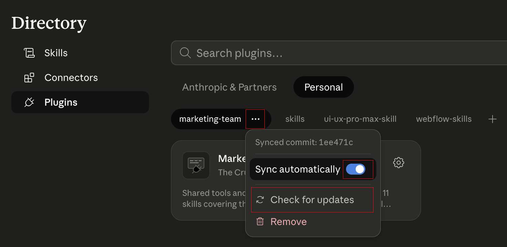

# Marketing Team

Shared plugin marketplace and brand reference for the marketing team. Skills fetch content live from this repo, so updates here are instantly available to everyone.

## Installation

| Step | Action |
|:----:|--------|
| 1 🚀 | Open Claude Cowork |
| 2 ⚙️ | Click <kbd>Customize</kbd> in the sidebar |
| 3 ➕ | Next to **Personal plugins**, click <kbd>+</kbd> |
| 4 🔍 | Click <kbd>Browse plugins</kbd> → select the **Personal** tab |
| 5 🏪 | Click <kbd>+</kbd> → select **Add marketplace** |
| 6 🔗 | Enter `cruciate-hub/marketing-team` → click <kbd>Sync</kbd> |
| 7 ➕ | Click the <kbd>+</kbd> to install |

Steps 8–11 pull in new skills and skill improvements automatically (whenever a commit lands on `main`). Without them, you'll stay frozen on the version you installed and miss every future update.

| Step | Action |
|:----:|--------|
| 8 🎛️ | Click the <kbd>⋯</kbd> next to `marketing-team` |
| 9 🔵 | Toggle <kbd>Sync automatically</kbd> |
| 10 🔄 | Click <kbd>Check for updates</kbd> |
| 11 🔁 | Close and reopen the Claude Desktop App |

## Available skills (15)

### Content creation

| Skill | What it does |
|---|---|
| **brand-messaging** | Applies brand voice, terminology, tone, and messaging frameworks to any written content. |
| **blog-seo-content** | SEO-optimized blog posts, thought leadership articles, and long-form content. |
| **aeo-content** | AEO (Answer Engine Optimization) articles for the `/answers/` collection, structured for AI search engine citation. |
| **social-media** | Platform-specific posts for LinkedIn, Instagram, and X with format and tone guidelines. |
| **campaign-copy** | Ad copy, campaign landing pages, and paid media content (Google, LinkedIn, Meta). |
| **newsletters** | Generates MailerLite-compatible HTML emails from monthly product update docs. |
| **case-study** | Customer stories and success case studies following the social.plus narrative structure. |

### Design & analysis

| Skill | What it does |
|---|---|
| **design-system** | Full visual design system — colors, typography, spacing, buttons, layout, accessibility, and more. |
| **site-intelligence** | Queries, audits, and analyzes the 10 website inventory files (marketing, industry, use cases, blog, glossary, answers, customer stories, release notes, product updates, webinars). |
| **product-update-vs-website** | Compares product release notes against live website content to find pages that need updating. |

### SEO & linking

| Skill | What it does |
|---|---|
| **internal-linking-optimizer** | Suggests SEO-grounded internal links for new content (invoked by `blog-seo-content` and `aeo-content`) and runs site-wide link audits. Uses a canonical anchor map and cannibalization warnings from `link-strategy.md`, with live page-fetch to verify insertion points. |
| **link-building-vetter** | Vets incoming ABC link exchange requests against social.plus guidelines, scores them 1-10, and drafts response emails. |
| **backlink-placement-finder** | Finds contextually relevant backlink placement opportunities on partner websites and drafts request emails. |

### Formatting & conversion

| Skill | What it does |
|---|---|
| **legal-docs-formatter** | Converts legal documents (MSA, DPA, SLA, Terms, Privacy, etc.) into clean HTML ready to paste into a Webflow Rich Text Embed block on a 📜 Legals CMS item. |
| **svg-icon-transformer** | Transforms SVG input into clean, accessible, inline-embed-ready icon markup with `1em` sizing and correct accessibility defaults. |

## Repo structure

| Path | Purpose |
|---|---|
| [`brain.md`](./brain.md) | Main brain — cross-domain routing, precedence rules, compliance check |
| [`messaging/`](./messaging) | Brand messaging files — tone, terminology, positioning, narrative, boilerplates, UI micro-copy |
| [`design-system/`](./design-system) | Full visual design system — colors, typography, spacing, buttons, shadows, layout, accessibility, and more. [View brand guidelines live](https://cruciate-hub.github.io/marketing-team/design-system/brand-guidelines.html) |
| [`assets/`](./assets) | Official logo SVGs |
| [`emails/`](./emails) | Email template reference, strategy guide, and HTML examples |
| [`website/`](./website) | Live website content JSON (auto-updated on every Webflow publish via a Cloudflare Worker) |
| [`skills/`](./skills) | The plugin source — contains the 15 skill definitions that fetch from the folders above |

## How updates work

**Reference content** (markdown files in `messaging/`, `design-system/`, `emails/`): Edit on GitHub, changes are live immediately for all team members. No reinstall needed.

**Skill logic** (SKILL.md files in `skills/`): Changes require team members to update the plugin.

**Website snapshots** (`website/pages-*.json`): 10 auto-generated JSON files covering every published page on social.plus — marketing, industry, use cases, blog, glossary, answers, customer stories, release notes, product updates, and webinars. Regenerated by a Cloudflare Worker on every Webflow publish (site publish refreshes marketing + industry; per-collection CMS publish refreshes the rest).
